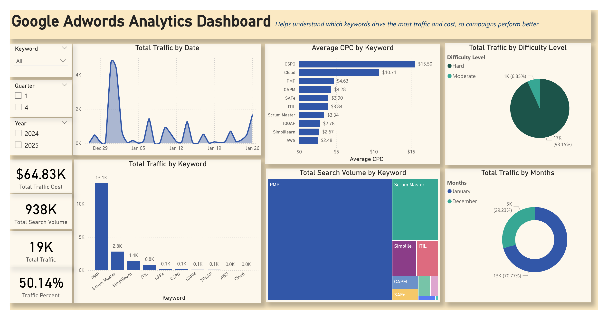
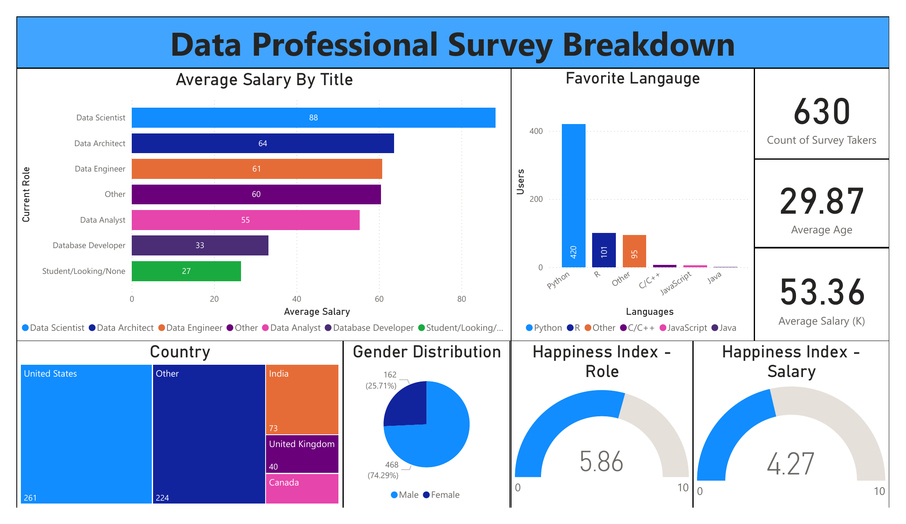

# Tirth Shah - Power BI & Data Analytics Portfolio

I build decision-focused dashboards that turn raw data into clear business insights. This portfolio highlights my work across Power BI report development, data modeling, DAX, SQL, Python, Excel, and end-to-end analytics workflows.

## Power BI specialist profile

- Interactive dashboard and KPI report development
- DAX measures and business metric design
- Power Query data preparation and transformation
- Star-schema modeling and relationship design
- SQL-based analysis and source integration
- Data storytelling, visual design, and executive reporting
- Python and Excel for repeatable data preparation

**Core keywords:** Power BI, DAX, Power Query, SQL, Python, Excel, ETL, data visualization, business intelligence, data modeling, star schema, dashboard design, KPI reporting, and data analytics.

## Featured dashboards

### 1. Google AdWords Analytics

[](projects/adwords-traffic-analysis/README.md)

Analyzes keyword traffic, CPC, search volume, advertising cost, and keyword difficulty through an interactive Power BI report supported by Python and MySQL.

[View project details](projects/adwords-traffic-analysis/README.md) · [Open PDF preview](projects/adwords-traffic-analysis/dashboard/dashboard-preview.pdf)

### 2. Data Professional Survey Breakdown

[](projects/data-professional-survey/README.md)

Explores salary, job roles, programming-language preferences, geography, demographics, and workplace satisfaction across 630 survey responses.

[View project details](projects/data-professional-survey/README.md) · [Open PDF preview](projects/data-professional-survey/dashboard/dashboard-preview.pdf)

## Repository structure

```text
.
├── projects/
│   ├── adwords-traffic-analysis/
│   │   ├── assets/
│   │   ├── dashboard/
│   │   ├── data/
│   │   ├── notebooks/
│   │   └── sql/
│   └── data-professional-survey/
│       ├── assets/
│       └── dashboard/
├── LICENSE
├── NOTICE.md
└── requirements.txt
```

Each project has its own README, report file, preview, business questions, dashboard features, and attribution notes. See [projects/README.md](projects/README.md) for the checklist used when adding future dashboards.

## About me

I am Tirth Shah, a data analyst focused on Power BI and practical business intelligence. My goal is to combine reliable data preparation with accessible dashboards that help stakeholders understand performance and take action.

## Acknowledgments

Special thanks to [Alex The Analyst](https://github.com/AlexTheAnalyst) for the tutorials and learning resources that supported my Power BI development. Dataset-specific attribution and licensing are documented within each project and in [NOTICE.md](NOTICE.md).
